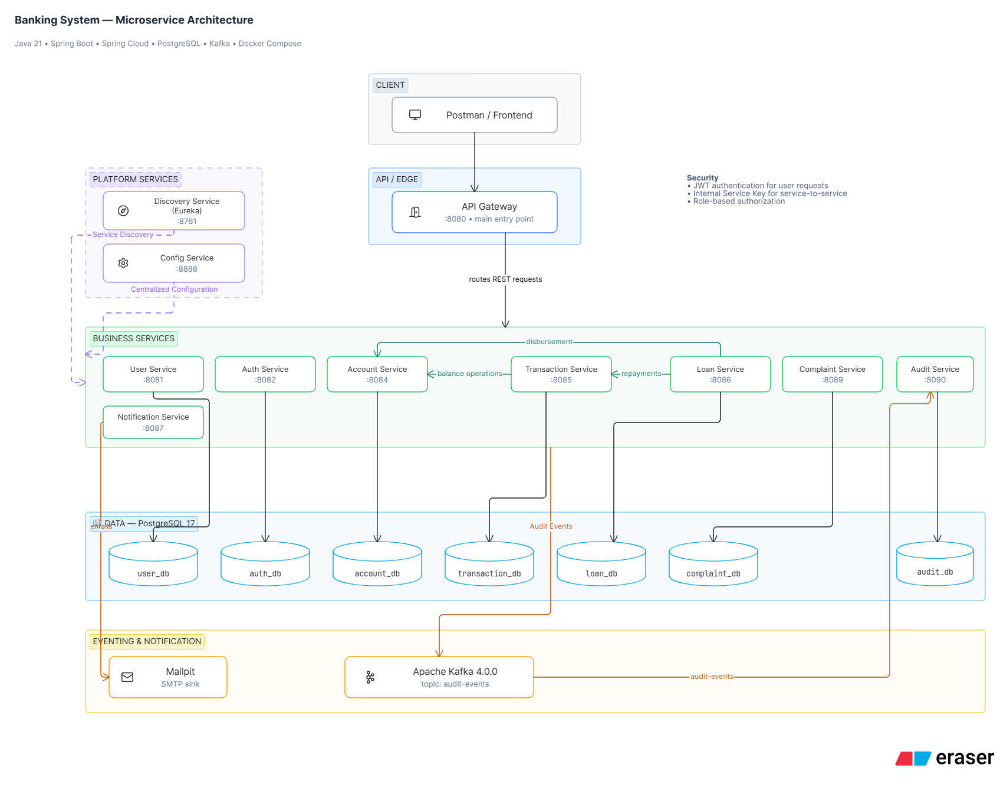

# Banking System

A production-oriented banking system built with Java and Spring Boot using a microservice architecture.

The project demonstrates authentication, account management, money transfers, loan management, complaints, audit logging, event-driven communication, service discovery, centralized configuration, API Gateway routing, and containerized infrastructure.

---



## Architecture

The system follows a microservice architecture where each business domain is implemented as an independent service.

```text
                         ┌─────────────────┐
                         │     Client      │
                         │  Postman / App  │
                         └────────┬────────┘
                                  │
                                  ▼
                         ┌─────────────────┐
                         │   API Gateway   │
                         │      :8080      │
                         └────────┬────────┘
                                  │
                    ┌─────────────┼─────────────┐
                    │             │             │
                    ▼             ▼             ▼
              User Service   Auth Service   Account Service
                 :8081          :8082           :8084
                    │             │             │
                    ▼             ▼             ▼
                 user_db       auth_db       account_db


                    ┌──────────────────────────┐
                    │    Discovery Service     │
                    │         Eureka           │
                    │          :8761            │
                    └────────────┬─────────────┘
                                 │
                         Service Discovery
                                 │
             ┌───────────────────┼───────────────────┐
             │                   │                   │
             ▼                   ▼                   ▼
      Transaction Service   Loan Service      Complaint Service
            :8085              :8086                 :8089
             │                   │                   │
             ▼                   ▼                   ▼
       transaction_db        loan_db           complaint_db


                    ┌──────────────────────────┐
                    │     Config Service       │
                    │          :8888            │
                    └──────────────────────────┘


                    ┌──────────────────────────┐
                    │          Kafka            │
                    │          :9092            │
                    └────────────┬─────────────┘
                                 │
                           audit-events
                                 │
                                 ▼
                    ┌──────────────────────────┐
                    │      Audit Service       │
                    │          :8090            │
                    └────────────┬─────────────┘
                                 │
                                 ▼
                              audit_db


                    ┌──────────────────────────┐
                    │   Notification Service   │
                    │          :8087            │
                    └────────────┬─────────────┘
                                 │
                                 ▼
                              Mailpit
                         SMTP :1025
                          UI :8025
```

---

## Microservices

| Service | Port | Responsibility |
|---|---:|---|
| API Gateway | 8080 | Single entry point and request routing |
| User Service | 8081 | User registration and user management |
| Auth Service | 8082 | Authentication, JWT and refresh tokens |
| Account Service | 8084 | Bank accounts and balance operations |
| Transaction Service | 8085 | Money transfers and transactions |
| Loan Service | 8086 | Loan lifecycle and loan payments |
| Notification Service | 8087 | Email notifications |
| Complaint Service | 8089 | Customer complaint management |
| Audit Service | 8090 | Audit event persistence |
| Discovery Service | 8761 | Eureka service discovery |
| Config Service | 8888 | Centralized application configuration |

---

## Technology Stack

### Backend

- Java 21
- Spring Boot 3.5.16
- Spring Cloud
- Spring Data JPA
- Hibernate 6.6.x
- Spring Security
- Spring Cloud Gateway
- Spring Cloud Netflix Eureka
- Spring Cloud Config
- OpenFeign
- MapStruct
- Lombok
- Flyway

### Infrastructure

- PostgreSQL 17
- Apache Kafka 4.0.0
- Docker
- Docker Compose
- Mailpit

### Security

- Spring Security
- JWT
- Internal Service Authentication
- Role-based authorization

### Build

- Maven

---

## Database Architecture

The project follows a **database-per-service** approach.

Each business service owns its own database.

```text
PostgreSQL
│
├── user_db
├── auth_db
├── account_db
├── transaction_db
├── loan_db
├── complaint_db
└── audit_db
```

Services do not directly access another service's database.

Communication between services is performed through REST/OpenFeign and asynchronous Kafka events where appropriate.

---

## Service Discovery

The project uses Eureka for service discovery.

```text
API Gateway
     │
     ▼
 Eureka Server
     │
     ├── USER-SERVICE
     ├── AUTH-SERVICE
     ├── ACCOUNT-SERVICE
     ├── TRANSACTION-SERVICE
     ├── LOAN-SERVICE
     ├── COMPLAINT-SERVICE
     ├── AUDIT-SERVICE
     └── NOTIFICATION-SERVICE
```

Discovery Service:

```text
http://localhost:8761
```

---

## Centralized Configuration

Configuration is managed through Spring Cloud Config Server.

```text
Microservices
      │
      ▼
Config Service :8888
      │
      ▼
config/
├── user-service.yml
├── auth-service.yml
├── account-service.yml
├── transaction-service.yml
├── loan-service.yml
├── complaint-service.yml
├── audit-service.yml
├── notification-service.yml
└── api-gateway.yml
```

The configuration supports both local development and Docker environments through environment variables.

---

## API Gateway

The API Gateway provides a single entry point for client requests.

```text
Client
  │
  ▼
http://localhost:8080
  │
  ├── /api/v1/users/**
  ├── /api/v1/auth/**
  ├── /api/v1/accounts/**
  ├── /api/v1/transactions/**
  ├── /api/v1/loans/**
  ├── /api/v1/complaints/**
  └── /api/v1/audit/**
```

The Gateway uses Eureka service discovery and Spring Cloud LoadBalancer to route requests to service instances.

---

## Security

The system uses two authentication mechanisms.

### User Authentication

User-facing requests are authenticated using JWT.

```http
Authorization: Bearer <JWT>
```

The JWT contains the authenticated user's identity and authorities.

### Internal Service Authentication

Service-to-service operations use an internal service key.

```http
X-Internal-Service-Key: <internal-key>
```

Internal operations are protected using the `INTERNAL_SERVICE` role.

For example:

```text
Transaction Service
        │
        │ Internal Service Authentication
        ▼
Account Service
```

This prevents clients from directly invoking internal balance operations.

---

## Core Business Flows

### User Registration

```text
Client
  │
  ▼
API Gateway
  │
  ▼
User Service
  │
  ├── PostgreSQL
  │
  ├── Audit Event
  │
  └── Notification
```

### Authentication

```text
Client
  │
  ▼
API Gateway
  │
  ▼
Auth Service
  │
  ▼
User Service
  │
  ▼
JWT
```

### Account Management

```text
Client
  │
  ▼
API Gateway
  │
  ▼
Account Service
  │
  ▼
account_db
```

### Money Transfer

```text
Client
  │
  ▼
API Gateway
  │
  ▼
Transaction Service
  │
  ├── Withdraw
  │      ↓
  │  Account Service
  │
  └── Deposit
         ↓
     Account Service
```

The transaction flow also supports compensation when required to maintain consistency between balance operations.

### Loan Lifecycle

```text
PENDING
   │
   ▼
APPROVED
   │
   ▼
ACTIVE / DISBURSED
   │
   ▼
PAYMENTS
   │
   ▼
REPAID
```

Loan operations integrate with Account and Transaction services.

---

## Event-Driven Architecture

Kafka is used for asynchronous audit processing.

```text
Business Services
       │
       │ AuditEvent
       ▼
     Kafka
       │
       │ audit-events
       ▼
 Audit Service
       │
       ▼
   audit_db
```

Services can publish audit events without directly depending on the Audit Service's database.

The main audit flow covers operations such as:

- User registration
- User email verification
- User login
- Account creation
- Money deposit
- Money withdrawal
- Transactions
- Loan operations
- Complaint operations

---

## Notification

Notification Service handles email delivery.

For local development, Mailpit is used instead of a production mail provider.

```text
Application
    │
    ▼
Notification Service
    │
    ▼
Mailpit SMTP
    │
    ▼
Web UI
```

Mailpit:

```text
SMTP: http://localhost:1025
Web UI: http://localhost:8025
```

---

## Project Structure

```text
banking-system/
│
├── common/
│
├── user-service/
├── auth-service/
├── notification-service/
├── account-service/
├── transaction-service/
├── loan-service/
├── complaint-service/
├── audit-service/
│
├── discovery-service/
├── config-service/
├── api-gateway/
│
├── docker/
│   └── postgres/
│       └── init/
│
├── docker-compose.yml
├── .env
├── .env.example
├── .gitignore
└── README.md
```

---

## Running the Application

### Prerequisites

Install:

- JDK 21
- Maven
- Docker Desktop

Verify:

```bash
java -version
mvn -version
docker --version
docker compose version
```

---

### Environment Variables

Create a `.env` file in the project root.

Example:

```env
POSTGRES_USER=bank_user
POSTGRES_PASSWORD=bank_password

JWT_SECRET=your-development-jwt-secret
INTERNAL_SERVICE_KEY=your-internal-service-key
```

Do not commit `.env` to Git.

Use `.env.example` as the template for required environment variables.

---

### Build

Build all services without running tests:

```bash
mvn clean package -DskipTests
```

---

### Build Docker Images

```bash
docker compose build
```

---

### Start the System

```bash
docker compose up -d
```

Check containers:

```bash
docker compose ps
```

View logs:

```bash
docker logs banking-gateway --tail 100
```

---

### Stop the System

```bash
docker compose down
```

The PostgreSQL volume is preserved.

To remove persistent database data as well:

```bash
docker compose down -v
```

> Use `down -v` carefully because it deletes the PostgreSQL Docker volume.

---

## Development Workflow

After changing Java code:

```bash
mvn clean package -DskipTests
docker compose build
docker compose up -d
```

After changing only Docker Compose configuration:

```bash
docker compose up -d
```

After changing Config Server configuration, rebuild the Config Service:

```bash
mvn clean package -DskipTests
docker compose build config-service
docker compose up -d config-service
```

---

## Health and Startup

Docker Compose uses health checks for infrastructure and core platform services.

Startup dependencies are controlled using:

```yaml
depends_on:
  condition: service_healthy
```

This ensures that services such as Config Server do not start before their required infrastructure is ready.

The intended startup flow is:

```text
PostgreSQL
    ↓
Kafka
    ↓
Eureka
    ↓
Config Server
    ↓
Business Services
    ↓
API Gateway
```

---

## API Overview

The main API groups are:

```text
/api/v1/users
/api/v1/auth
/api/v1/accounts
/api/v1/transactions
/api/v1/loans
/api/v1/complaints
/api/v1/audit
```

The API Gateway is the primary client-facing entry point.

---

## Error Handling

The project uses centralized API error response structures through the shared `common` module.

Typical API errors include:

- Validation errors
- Authentication errors
- Authorization errors
- Resource not found
- Business rule violations
- Insufficient balance
- Invalid loan state
- Invalid transaction state

---

## Shared Common Module

The `common` module contains shared contracts and infrastructure-independent components used by multiple services.

Examples include:

- API error models
- Error codes
- Audit contracts
- Shared enums and DTO-related contracts

`common` is a library module and is **not** a microservice.

---

## Current Status

The following major components have been implemented:

- [x] User Service
- [x] Authentication Service
- [x] JWT authentication
- [x] Refresh token flow
- [x] Notification Service
- [x] API Gateway
- [x] Eureka Discovery
- [x] Config Server
- [x] Account Service
- [x] Transaction Service
- [x] Loan Service
- [x] Complaint Service
- [x] Audit Service
- [x] Kafka audit events
- [x] PostgreSQL database-per-service architecture
- [x] Docker Compose
- [x] Docker health checks
- [x] Internal service authentication
- [x] Gateway-based integration flow
- [x] Account cash-in
- [x] Money transfer
- [x] Loan lifecycle
- [x] Email notification flow

---

## Future Improvements

Potential future improvements include:

- Automated unit and integration tests
- Testcontainers
- CI/CD pipeline
- Production-grade secrets management
- Distributed tracing
- Metrics and monitoring
- Centralized logging
- Rate limiting
- API documentation improvements
- Production payment provider integration
- Kubernetes deployment
- High availability and horizontal scaling

---

## License

This project is intended for educational, portfolio, and demonstration purposes.